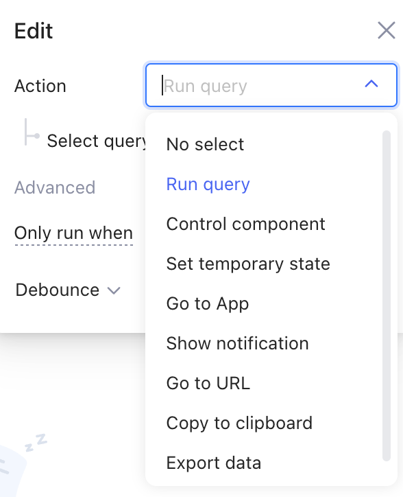
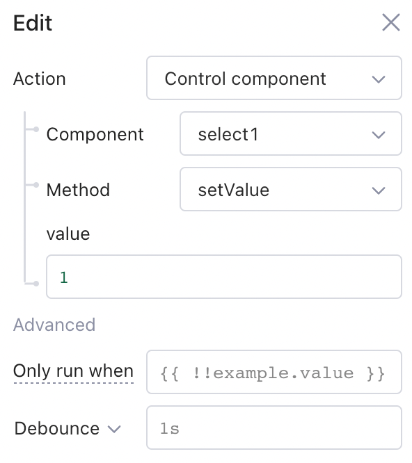
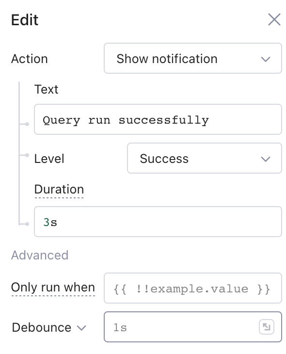
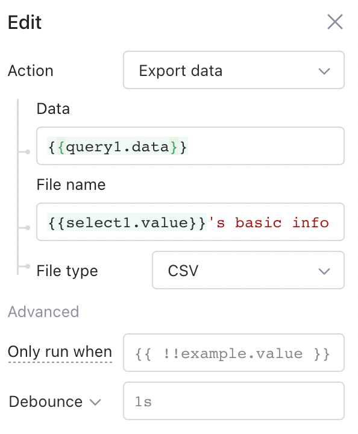

# Manipuladores de eventos

No PocketBlocks, os manipuladores de eventos são responsáveis ​​por coletar e processar eventos de componentes e consultas e executar ações subsequentes. Por exemplo, para um componente **Botão**, você pode adicionar um manipulador de eventos para acionar a ação **Executar consulta** em resposta ao evento **Clique** do botão.

<figure><figcaption></figcaption></figure>

Defina manipuladores de eventos com sabedoria para fornecer uma experiência de usuário (UX) reativa e responsiva. Por exemplo, acionar uma consulta **retorna todos os dados** após o término da consulta de **inserção de dados** permite a atualização automática da tabela.


Você pode adicionar quantos manipuladores de eventos desejar para um único componente ou consulta, e esses manipuladores de eventos serão executados simultaneamente.


## Eventos

### Eventos de componentes

Componentes diferentes têm eventos diferentes. Por exemplo, os componentes **Botão** possuem apenas um evento **Clique**.

<figure><figcaption></figcaption></figure>

Os componentes **Input** têm eventos **Mudar**, **Foco**, **Desfoque** e **Enviar**.

<figure><figcaption></figcaption></figure>

### Consultar eventos

A execução de uma consulta pode resultar em sucesso ou falha, portanto, as consultas têm dois eventos: **Sucesso** ou **Falha**. Você pode adicionar manipuladores de eventos a consultas no Editor de consultas.

<figure><figcaption></figcaption></figure>

## Ações

Existem várias ações de manipulador de eventos disponíveis no PocketBlocks para lidar com diferentes cenários. Defina-os na lista suspensa **Ação** em um manipulador de eventos.


Consulte [avançado](event-handlers.md#advanced) nesta página para conhecer as configurações avançadas.


### Executar consulta

Acione a consulta selecionada.

### Controlando Componentes

Para controlar um componente, selecione um componente na lista suspensa **Componente** e chame um de seus métodos na lista suspensa **Método**.

### Definir estado temporário

Armazene dados em um [estado temporário](write-javascript/temporary-state.md).&#x20;

### Vá para um aplicativo

Navegue até um aplicativo PocketBlocks com consulta opcional ou parâmetros de hash.

| Parâmetro                  | Função                                                                                             |
| -------------------------- | -------------------------------------------------------------------------------------------------- |
| 
Consulta de URL 
 | 
Anexar <code>?key1=value1&#x26;key2=value2...</code> ao URL do aplicativo a ser aberto. 
 |
| Hash de URL                | Anexe `#key1=value1&key2=value2...` ao URL do aplicativo a ser aberto.                             |

#### **Caso de uso**

No aplicativo **Lista de usuários**, clique em **Ver informações** para navegar até o aplicativo **Informações do usuário** e as informações detalhadas do usuário na linha selecionada serão exibidas.

1. O aplicativo **Lista de usuários** passa `{{currentRow.id}}` na linha da tabela como um parâmetro de consulta de URL para o aplicativo **Informações do usuário**.

<figure><figcaption></figcaption></figure>

2. O campo URL da variável global do aplicativo **Informações do usuário** resolverá automaticamente o URL solicitado pelo aplicativo. Neste caso, o valor de `url.query` é `{"id":3}`, então a consulta recuperará as informações do usuário correspondentes via `{{url.query.id}}`. Veja a figura abaixo.

<figure><figcaption></figcaption></figure>

### Ir para URL

Navegue para um URL externo.

### Mostrar notificação

Mostre uma notificação flutuante de mensagem informativa, de sucesso, de aviso ou de erro.

### Copiar para área de transferência

Copie um valor para a área de transferência.

### Exportar dados

Exporte dados em um determinado tipo de arquivo (TXT, JSON, CSV e Excel).

## Avançado

### Execute apenas quando

A ação só pode ser acionada sob uma condição especificada. Configure a condição de execução de um manipulador de eventos na opção **Executar somente quando** e, em seguida, o manipulador de eventos será executado somente quando esta condição for avaliada como `true`.

### Debounce e throttle

**Debounce** e **Throttle** reduzem a frequência de acionamento da ação.

#### **Debounce**

Debounce atrasa uma ação. Uma vez definido o tempo de debounce, a ação não será executada imediatamente após o evento até que o tempo de debounce passe. Se o evento ocorrer novamente antes do término do tempo, o tempo de debounce será cronometrado novamente. Por exemplo, um componente de entrada aciona uma consulta quando o usuário altera o texto. Se a execução da consulta for cara e você não quiser executá-la depois que cada caractere for digitado, você poderá atrasar a execução da consulta definindo o tempo de rejeição. Então a consulta só será executada depois que o usuário terminar de digitar.

#### **Throttle**

Throttle permite que uma ação aconteça apenas uma vez durante um período de tempo especificado. Por padrão, cada evento desencadeia uma ação, mas às vezes executar uma ação pode custar caro. Por exemplo, você define um identificador de evento para acionar a ação **Executar consulta** para atualizar dados em resposta ao evento **Clique**, mas acha que essa consulta é muito cara para ser executada, então você pode definir um tempo de aceleração para permitir que a consulta seja executada apenas uma vez em um determinado período.
