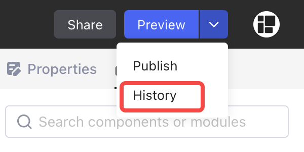
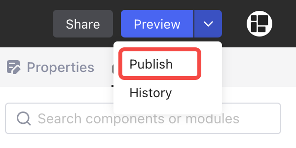

# Gerenciamento de versões e publicações

O gerenciamento de versão e lançamento visa fornecer uma versão estável ao vivo para usuários finais e permite que você crie e teste seu aplicativo com segurança.

Por padrão, os usuários finais interagem com a versão mais recente do seu aplicativo. Depois de esboçar e modificar suas ideias, você pode visualizar e comparar com diferentes versões do histórico e, finalmente, publicar a versão que atenda a todas as suas necessidades. A versão recém-publicada agora fica ativa e todas as suas atualizações futuras não afetarão a versão ativa até que você publique novamente.

## Histórico de versões

PocketBlocks armazena automaticamente todas as alterações do seu histórico durante a construção de um aplicativo, como adição ou exclusão de componentes, ajuste de propriedade dos componentes, reorganização do layout e atualização de uma função personalizada. Você pode usá-lo para consultar suas ideias anteriores ou reverter para uma versão anterior.

As versões do histórico do aplicativo só podem ser acessadas por administradores.

### Visualizando uma versão do histórico

Você pode visualizar qualquer versão de seus rascunhos anteriores. Clique em **Visualizar** **>** **Histórico**.

### Restaurando uma versão do histórico

Você pode restaurar seu rascunho atual para uma versão do histórico.

1. Selecione a versão de destino na lista de versões do histórico
2. Clique em **Restaurar esta versão** na barra superior

<figure><figcaption></figcaption></figure>

## Gerenciamento de publicações

Os aplicativos geralmente são atualizados regularmente para incluir novos recursos, melhorar processos de negócios e corrigir falhas. No entanto, o desenvolvimento de uma nova versão de um aplicativo leva tempo e você precisa garantir que a experiência do usuário não seja afetada durante esse progresso.

Por padrão, os usuários finais interagem com a versão mais recente do seu aplicativo. Depois de finalizar o esboço de uma versão mais recente do seu aplicativo, você poderá publicá-lo. Clique em **Visualizar > Publicar**.

Agora a versão recém-lançada está disponível para todos os usuários finais e todas as suas atualizações futuras não afetarão a versão ativa até que você publique novamente.
